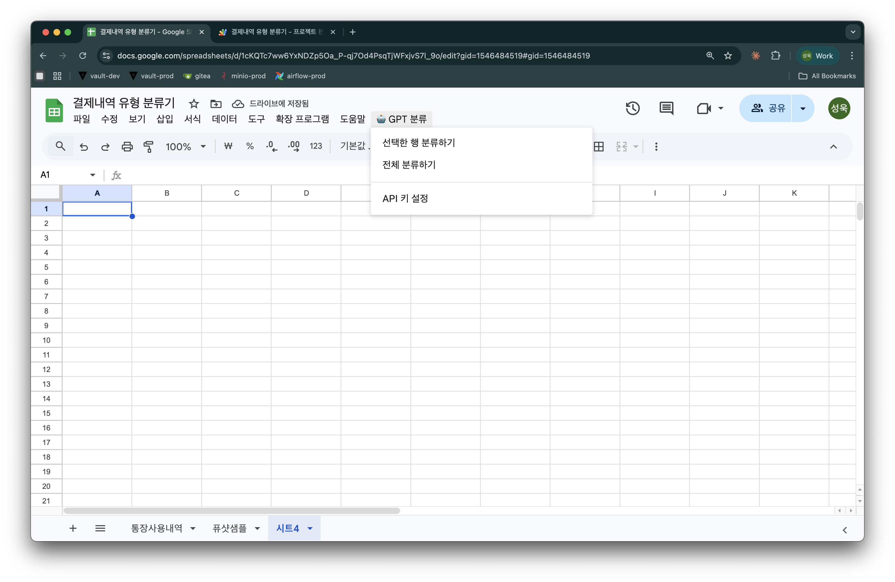

# 103. App Script — 구글 시트에서 GPT 사용하기

> Session 1: AI 활용

## 이것은 무엇인가요?

Google Apps Script를 활용해 구글 시트 안에서 GPT를 함수처럼 사용하는 방법입니다.

## 왜 유용한가요?

- 시트 데이터를 AI로 자동 분류, 요약, 번역할 수 있습니다
- 반복적인 텍스트 처리를 자동화할 수 있습니다

## 데모

### 1. Gmail 라벨링 — GPT로 메일 자동 분류

메일이 도착하면 Apps Script가 내용을 읽고, GPT에게 분류를 요청해 자동으로 라벨을 적용합니다.

**최근 메일을 가져와서 GPT로 분류합니다:**

```javascript
const threads = GmailApp.search('newer_than:7d', 0, 10);

for (const thread of threads) {
  const message = thread.getMessages()[0];
  const category = callGPT(message.getSubject(), message.getPlainBody(), message.getFrom());

  // 라벨 가져오기 (없으면 생성)
  const label = GmailApp.getUserLabelByName(category)
    || GmailApp.createLabel(category);
  label.addToThread(thread);
}
```

**GPT에게 카테고리를 물어봅니다:**

```javascript
const payload = {
  model: 'gpt-4o-mini',
  messages: [
    { role: 'system', content: '메일을 다음 카테고리 중 하나로 분류하세요.\n카테고리: 고객문의, 마케팅, 내부공유, 일정, 기타' },
    { role: 'user', content: `발신: ${from}\n제목: ${subject}\n본문: ${body.substring(0, 500)}` }
  ],
  temperature: 0.1
};

const response = UrlFetchApp.fetch('https://api.openai.com/v1/chat/completions', options);
```

> 전체 코드: [gmail-labeling.gs](../../materials/103-app-script/gmail-labeling.gs)

### 2. Sheets GPT 연동 — 통장 내역 자동 분류

구글 시트에서 커스텀 메뉴를 만들고, 통장 사용 내역을 GPT로 자동 분류하는 예시입니다.

**시트를 열면 커스텀 메뉴가 생깁니다:**

```javascript
function onOpen() {
  const ui = SpreadsheetApp.getUi();
  ui.createMenu('🤖 GPT 분류')
    .addItem('선택한 행 분류하기', 'classifySelectedRows')
    .addItem('전체 분류하기', 'classifyAllRows')
    .addToUi();
}
```

**GPT API를 호출해서 분류합니다:**

```javascript
const payload = {
  model: 'gpt-4o-mini',
  messages: [
    { role: 'system', content: systemPrompt },  // 분류 체계 + 퓨샷 예시
    { role: 'user', content: `다음 통장 내역을 분류해주세요:\n\n${itemList}` }
  ],
  temperature: 0.1
};

const response = UrlFetchApp.fetch('https://api.openai.com/v1/chat/completions', options);
```

**결과를 시트에 바로 씁니다:**

```javascript
sheet.getRange(row, 5).setValue(results[j].middleCategory);  // 중분류
sheet.getRange(row, 6).setValue(results[j].subCategory);      // 소분류
```

이 코드 전체를 Claude로 생성했습니다. → 전체 코드: [sheets-classification.gs](../../materials/103-app-script/sheets-classification.gs)



## 핵심 포인트

- Apps Script = 구글 워크스페이스 안에서 자동화 코드를 실행하는 기능
- GPT API를 연결하면 메일 분류, 데이터 처리 등을 자동화할 수 있다

---

이전: [← 102. Chrome Extension](./102-chrome-extension.md) | 다음: [104. MCP →](./104-mcp.md)
