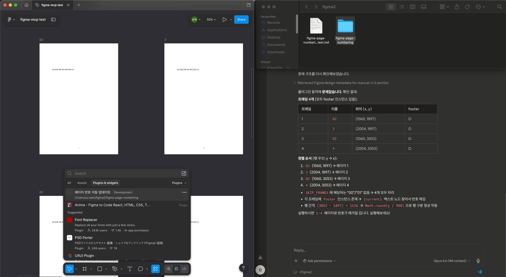

# 104. MCP — 외부 서비스 연동

> Session 1: AI 활용

## 이것은 무엇인가요?

MCP(Model Context Protocol)는 AI 모델이 외부 서비스(Notion, Slack, Figma 등)와 직접 소통할 수 있게 해주는 프로토콜입니다.

## 왜 유용한가요?

- AI가 Notion 페이지를 직접 읽고 정리할 수 있습니다
- Slack 메시지를 요약하거나 작성할 수 있습니다
- Figma 디자인을 읽고 코드로 변환할 수 있습니다

## 데모

### Slack MCP

Slack 채널의 메시지를 읽고 요약하거나, 메시지를 작성할 수 있습니다.

<!-- TODO: 간단한 예시 -->

### Notion MCP

Notion 페이지를 읽고 정리하거나, 새 페이지를 생성할 수 있습니다.

<!-- TODO: 간단한 예시 -->

### Figma MCP (심화)

Figma 디자인을 읽고 코드로 변환하거나, 플러그인을 만들 수 있습니다.

Claude Code + Figma MCP를 활용해 **자동 쪽번호 매기기 플러그인**을 구성한 사례를 시연합니다.

> 전체 코드 및 맥락: [materials/104-mcp/](../../materials/104-mcp/)

## 핵심 포인트

- MCP = AI가 외부 서비스와 직접 소통하는 프로토콜
- Slack, Notion, Figma 등 업무 도구를 AI에 연결할 수 있다
- Claude Code + Figma MCP로 플러그인까지 만들 수 있다

---

이전: [← 103. App Script](./103-app-script.md) | 다음: [105. Webhook & Cron →](./105-webhook-cron.md)
